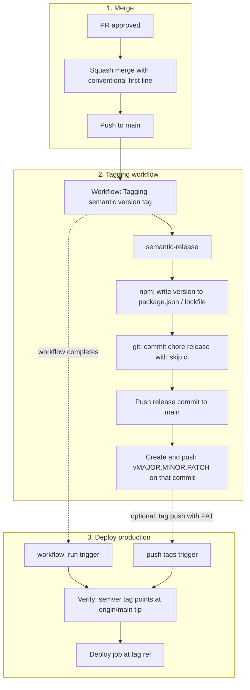
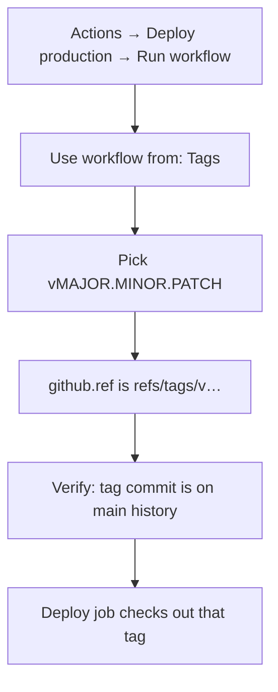

# Developer guide: production releases and versioning

This repository deploys production from **semver tags** (`vMAJOR.MINOR.PATCH`). When a releasable change lands on `main`, **semantic-release** updates **`package.json` / `package-lock.json`**, pushes a **release commit** to `main`, then creates and pushes the **git tag** on that commit. **No GitHub Releases** are created — use the repository **Tags** page.

**What semantic-release reads:** the **actual commit(s)** on `main` after merge — for squash merge, that is whatever appears in the **Squash and merge** commit message box in the GitHub UI (first line = subject), not the PR title unless you leave the default unchanged.

## Deployment flow (diagrams)

### Automatic path (merge → tag → deploy)

After you merge to `main`, **Tagging** runs once. Inside that run, semantic-release may add a **second** commit (the version bump) with `[skip ci]` so GitHub does **not** start another Tagging run for that push. **Deploy (production)** is started by **`workflow_run`** when Tagging **completes**, then resolves the semver tag on the **current tip of `main`** (the release commit).

**Why `workflow_run`?** Pushes made with the default **`GITHUB_TOKEN`** (including tag pushes from Actions) do **not** trigger other workflows. The deploy workflow listens for **successful completion** of Tagging and then finds the new tag on `main`.

**Why not rely on `workflow_run.head_sha`?** That SHA is the commit that **started** Tagging (often the merge commit). The semver tag is placed on the **release** commit after `@semantic-release/git`, so deploy resolves tags with `--points-at` **`origin/main`** after `git fetch`.

### Manual path (`workflow_dispatch`)

To **redeploy** an existing version without a new merge, run **Deploy (production)** from the **Actions** tab. You must select a **tag ref**, not `main`.

If **Use workflow from** stays on the **default branch**, the run uses `refs/heads/main`, the verify step **skips** deploy, and logs explain that you need a tag ref.

## What you need to do

### 1. Use squash merge into `main`

Merge with **Squash and merge**. Before you confirm, edit the **commit message** so the **first line** follows conventional commit format (see below). Reviewers approve the PR; they do **not** automatically enforce this message — whoever merges is responsible for the final text.

### 2. Conventional first line (subject) examples

| Intent | Example first line |
|--------|---------------------|
| New feature (minor bump) | `feat: add invoice export` |
| Bug fix (patch bump) | `fix: correct tax rounding` |
| Breaking change (major bump) | `feat!: remove legacy API` |
| Docs / chore only (often no release) | `docs: update README` — may not trigger a version bump |

The repo also maps extra **types** in `.releaserc.json` (for example `hotfix`, `feature`, `tweak`) — see that file for the full list.

Use types your team agrees on (`feat`, `fix`, `perf`, `refactor`, etc.). **Avoid** vague subjects like `Update stuff` — semantic-release may not produce a new tag, or the wrong bump may be inferred.

### Breaking changes (major version)

The analyzer uses the **Conventional Commits** preset so `feat!:` / `fix!:` in the **subject** counts as a breaking change.

- **Do not** use a squash message whose **only** line is `BREAKING CHANGE: …` — that belongs in the **body** after a blank line, under a normal header such as `feat: what changed`.
- Prefer subject: `feat!: what changed` (or `fix!: …`).
- Or subject `feat: what changed` and in the **extended description** (body): `BREAKING CHANGE: why it is breaking`.

## What happens in CI

1. **Merge to `main`** runs the **Tagging** workflow ([`tag.yml`](../.github/workflows/tag.yml)). semantic-release analyzes commits since the last tag, may bump **`package.json`**, commits **`chore(release): … [skip ci]`**, pushes to `main`, then creates and pushes **`vMAJOR.MINOR.PATCH`** on that release commit.
2. **Deploy (production)** runs when Tagging **completes successfully** (`workflow_run`), then selects the semver tag on the **current `origin/main` tip**. Tag pushes made with the default `GITHUB_TOKEN` do **not** trigger other workflows; `workflow_run` covers the normal case.
3. **Pushing a matching tag** with a **PAT** or from outside Actions can still trigger **Deploy (production)** via the tag **`push`** trigger (same verify rules: tag must point to a commit on `main`).
4. **Manual redeploy**: **Actions → Deploy (production) → Run workflow**. Under **Use workflow from**, switch to **Tags** and pick **`vX.Y.Z`**. Runs started from **`main`** are intentionally skipped.

If you later configure semantic-release to use a **PAT** so tag pushes always trigger workflows, a release could start both the **`workflow_run`** deploy and the **`push`** deploy for the same tag. In that case, remove the `workflow_run` trigger from **Deploy (production)** or accept redundant runs and rely on idempotent deploys.

**Note:** GitHub runs the workflow file **as it exists on that tag’s commit** when you dispatch from a tag. If deploy logic changed later on `main`, redeploying an old tag still uses the older workflow definition.

## Troubleshooting

- **No new tag after merge**: Usually only releasable types trigger a version; pure `chore:` / `docs:` may not. Check the **Tagging** workflow logs on `main`.
- **Wrong version bump**: Fix comes from the **squashed commit message** you confirmed in GitHub. Use `feat!:` / `fix!:` in the subject, or `BREAKING CHANGE:` in the body **after** a normal `type: subject` line — not as the only line.
- **Manual run did not deploy**: Confirm **Use workflow from** is a **`vMAJOR.MINOR.PATCH` tag**, not a branch.

## Repo settings to confirm with maintainers

- Default merge style: **squash merge**; optionally **default squash message from PR title** to reduce editing, but the merger should still verify the final message.
- Branch protection: pull requests and **reviewers** required into `main` where policy applies; restrict direct pushes if that is policy.
