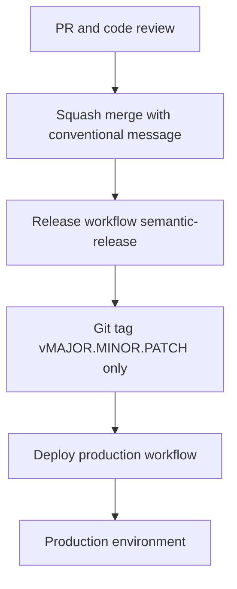

# Automated release and production deploy — brief for senior review

This document summarizes what the repository automates today, what it assumes, and what still depends on GitHub configuration and team process. It is written for engineering leads deciding whether to adopt or extend this pattern.

---

## Executive summary

| Area | Status |
|------|--------|
| **Semver tagging from conventional commits** | Implemented (`semantic-release` + Conventional Commits preset on `main`). |
| **GitHub Releases** | **Not** used — only **git tags** are pushed (no `POST /releases`, no release notes UI). |
| **Prod deploy after a new version tag** | Implemented (`workflow_run` after Release finds tag `--points-at` merge commit; tag `push` covers PAT/manual tags). |
| **Automated PR title / commit-message lint** | **Not** used; **squash commit message** (merge dialog) is the release input — discipline is human (merger + reviewers for code, not for message format). |
| **Blocking direct pushes to `main`** | **Not** enforced by these workflows — requires **branch protection / rulesets**. |
| **Real prod deploy commands** | Placeholder in workflow; replace with your platform (K8s, VM, PaaS, etc.). |

**Bottom line:** The **automation path** is coherent: tags on `main` drive production deploys. **Governance** (protected `main`, required reviews) limits who merges; **conventional squash messages** remain a **process** responsibility.

---

## Intended flow

1. Developers open PRs; **reviewers** approve per branch protection.
2. On **Squash and merge**, the merger sets the **commit message** so the first line follows [Conventional Commits](https://www.conventionalcommits.org/); that text is what **semantic-release** analyzes on `main`.
3. After merge to **`main`**, **Release** runs: analyzes all commits since the last tag, applies the **strongest** applicable semver bump, creates and pushes a **git tag** only (semantic-release core — no GitHub Release, no changelog commit).
4. **Deploy (production)** runs when Release completes successfully (`workflow_run`), resolving the tag on the merge commit — avoids relying on tag `push` events from `GITHUB_TOKEN`, which GitHub does not forward to other workflows.
5. Optional: manual redeploy by running Deploy with **Use workflow from** set to an existing **`v*.*.*`** tag.

---

## What is implemented in code

| Artifact | Role |
|----------|------|
| [`.releaserc.json`](../.releaserc.json) | `main` only; `@semantic-release/commit-analyzer` with Conventional Commits preset — **no** `github` / `changelog` / `git` plugins. |
| [`release.yml`](../.github/workflows/release.yml) | Trigger: `push` to `main`. `permissions: contents: write`. Runs `npm ci` and `npx semantic-release`. |
| [`deploy-prod.yml`](../.github/workflows/deploy-prod.yml) | Triggers: semver tag `push`, `workflow_run` after Release, `workflow_dispatch` from a **tag** ref. `workflow_run` resolves tag with `--points-at` the Release workflow head commit. |
| [`package.json`](../package.json) | Dev dependencies: `semantic-release`, `@semantic-release/commit-analyzer`, `conventional-changelog-conventionalcommits`. |

Operational detail for developers lives in [developer-release-workflow.md](./developer-release-workflow.md). Copy-paste artifacts: [ci-release-code-reference.md](./ci-release-code-reference.md).

---

## Versioning semantics (what seniors usually care about)

- **All commits since the last release tag** are considered; the bump is the **maximum** implied by any of them (e.g. one `feat!:` among several `fix:` commits still drives a breaking/major bump per policy).
- **Non-conventional** commit messages do not contribute to the bump (they are skipped for analysis).
- **Breaking changes** should use `feat!:` / `fix!:` in the **subject**, or a proper header plus `BREAKING CHANGE:` in the **body** — not a standalone `BREAKING CHANGE:` line as the only message (analyzer treats that as invalid).
- **Pre-1.0** versions (`v0.x.y`) follow semver semantics you configure; align with product on when to ship `v1.0.0`.

---

## Governance and gaps (pitch these honestly)

### 1. Branch protection on `main` (recommended required)

Workflows **cannot** prevent direct pushes to `main` by themselves. To avoid unreviewed changes on `main`:

- Require pull requests before merging.
- Require **reviewers** (and approvals) as appropriate.
- Restrict who can push to `main`.
- Optionally disallow force-push and branch deletion.

**Reviewers** enforce code review policy; they do **not** by default enforce conventional **merge commit** wording.

### 2. Deploy job is a stub

The production workflow still contains a placeholder step (`echo`); production credentials, rollout strategy, smoke tests, and rollback belong in a follow-up change. The **gating** (only tagged commits on `main`) is already in place.

### 3. `GITHUB_TOKEN` and duplicate deploys

Today semantic-release uses `GITHUB_TOKEN`, so tag pushes do not trigger downstream workflows; **`workflow_run`** is the intentional fix. If you later use a **PAT** for semantic-release so tag pushes fire workflows, you could get **two** deploys per release unless you remove one trigger or make deploy idempotent — documented in [developer-release-workflow.md](./developer-release-workflow.md).

### 4. Manual dispatch from a tag

Redeploy uses **workflow_dispatch** with the run ref set to a **version tag** so `github.ref` is `refs/tags/v…`. The workflow definition executed is the one **at that tag**; if deploy logic on `main` has moved on, old-tag reruns use older YAML (usually acceptable for “replay this release”).

---

## Adoption checklist (for leads)

- [ ] Protect `main`: PRs required, **reviews** as needed, no casual direct push.
- [ ] Repo setting: squash merge; team agreement on **who checks** the squash message before merge.
- [ ] Replace Deploy placeholder with real prod steps and secrets / environments.
- [ ] Confirm team understands conventional **squash** subjects and breaking-change format.
- [ ] (Optional) Environments with required reviewers for production deploy jobs.

---

## Why this is a defensible approach for seniors

- **Separation of concerns:** tagging (Release) and gating prod (tags on `main`) are separate workflows with clear triggers.
- **Aligns with common practice:** Conventional Commits + semantic-release + tag-based deploy.
- **Known platform limitation addressed:** `workflow_run` after Release avoids silent failure when tags are created with `GITHUB_TOKEN`.
- **Minimal release surface:** tags only — no duplicate release artifacts or changelog commits on `main`.

---

## References

- [developer-release-workflow.md](./developer-release-workflow.md) — day-to-day developer instructions.
- [ci-release-code-reference.md](./ci-release-code-reference.md) — file-by-file code reference for replication.
