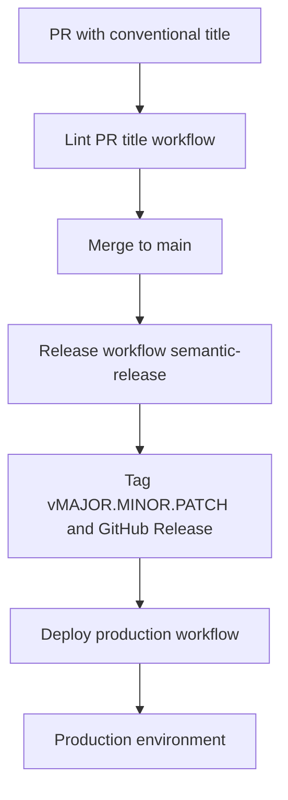

# Automated release and production deploy — brief for senior review

This document summarizes what the repository automates today, what it assumes, and what still depends on GitHub configuration and team process. It is written for engineering leads deciding whether to adopt or extend this pattern.

---

## Executive summary

| Area | Status |
|------|--------|
| **Semver tagging from conventional commits** | Implemented (`semantic-release` + Conventional Commits preset on `main`). |
| **Prod deploy after a new version tag** | Implemented (deploy chained after Release via `workflow_run`; tag `push` covers PAT/manual tags). |
| **PR title quality gate** | Implemented in CI; **merge blocking** requires **required status checks** on `main`. |
| **Blocking direct pushes to `main`** | **Not** enforced by these workflows — requires **branch protection / rulesets**. |
| **Real prod deploy commands** | Placeholder in workflow; replace with your platform (K8s, VM, PaaS, etc.). |

**Bottom line:** The **automation path** is coherent and industry-standard. **Governance** (protected `main`, required checks) is what makes the process hard to bypass by mistake. Together they form a complete story; neither replaces the other.

---

## Intended flow

1. Developers open PRs; titles follow [Conventional Commits](https://www.conventionalcommits.org/) (aligned with squash merge).
2. **Lint PR title** validates the title on `pull_request` events.
3. After merge to **`main`**, **Release** runs: analyzes all commits since the last tag, applies the **strongest** applicable semver bump, publishes a **Git tag** and **GitHub Release** when there are releasable changes.
4. **Deploy (production)** runs when Release completes successfully (`workflow_run`), resolving the new tag on the release commit — this avoids relying on tag `push` events from `GITHUB_TOKEN`, which GitHub does not forward to other workflows.
5. Optional: manual redeploy by running Deploy with **Use workflow from** set to an existing **`v*.*.*`** tag.

---

## What is implemented in code

| Artifact | Role |
|----------|------|
| [`.releaserc.json`](../.releaserc.json) | `main` only; Conventional Commits preset for analyzer and release notes; GitHub plugin for tag/release. |
| [`release.yml`](../.github/workflows/release.yml) | Trigger: `push` to `main`. Runs `npm ci` and `npx semantic-release`. |
| [`deploy-prod.yml`](../.github/workflows/deploy-prod.yml) | Triggers: semver tag `push`, `workflow_run` after Release (success + tag on commit), `workflow_dispatch` from a **tag** ref. Verifies tag commit is on `main` before deploy. |
| [`lint-pr-title.yml`](../.github/workflows/lint-pr-title.yml) | Trigger: `pull_request`. Validates PR title with `amannn/action-semantic-pull-request`. |
| [`package.json`](../package.json) | Dev dependencies: `semantic-release`, plugins, `conventional-changelog-conventionalcommits`. |

Operational detail for developers (titles, breaking changes, troubleshooting) lives in [developer-release-workflow.md](./developer-release-workflow.md). Copy-paste artifacts for new repos: [ci-release-code-reference.md](./ci-release-code-reference.md).

---

## Versioning semantics (what seniors usually care about)

- **All commits since the last release tag** are considered; the bump is the **maximum** implied by any of them (e.g. one `feat!:` among several `fix:` commits still drives a breaking/major bump per policy).
- **Non-conventional** commit messages do not contribute to the bump (they do not “cancel” a release; they are skipped for analysis).
- **Breaking changes** should use `feat!:` / `fix!:` in the **subject** (especially with squash-from-title), or a proper header plus `BREAKING CHANGE:` in the **body** — not a standalone `BREAKING CHANGE:` line as the only message (analyzer treats that as invalid).
- **Pre-1.0** versions (`v0.x.y`) follow semver semantics you configure; bumps may not match intuition for “major” vs “next 0.x” — align with product on when to ship `v1.0.0`.

---

## Governance and gaps (pitch these honestly)

### 1. Branch protection on `main` (recommended required)

Workflows **cannot** prevent direct pushes to `main` by themselves. To avoid “everything merged straight to main” without review:

- Require pull requests before merging.
- Require approvals as appropriate.
- Restrict who can push to `main`.
- Optionally disallow force-push and branch deletion.

Without this, **Release** still runs on every `main` push, but **lint-pr-title** does not run (it is tied to PRs), and commit discipline falls back to raw commit messages only.

### 2. Required status check for PR title lint

A failing lint job does **not** block the merge button until an admin marks **`Lint PR title / Conventional PR title`** as a **required** check on `main` (branch protection or rulesets). See [developer-release-workflow.md](./developer-release-workflow.md).

### 3. Deploy job is a stub

The production workflow still contains a placeholder step (`echo`); production credentials, rollout strategy, smoke tests, and rollback belong in a follow-up change. The **gating** (only tagged commits on `main`) is already in place.

### 4. `GITHUB_TOKEN` and duplicate deploys

Today semantic-release uses `GITHUB_TOKEN`, so tag pushes do not trigger downstream workflows; **`workflow_run`** is the intentional fix. If you later use a **PAT** for semantic-release so tag pushes fire workflows, you could get **two** deploys per release unless you remove one trigger or make deploy idempotent — documented in [developer-release-workflow.md](./developer-release-workflow.md).

### 5. Manual dispatch from a tag

Redeploy uses **workflow_dispatch** with the run ref set to a **version tag** so `github.ref` is `refs/tags/v…`. The workflow definition executed is the one **at that tag**; if deploy logic on `main` has moved on, old-tag reruns use older YAML (usually acceptable for “replay this release”).

### 6. Forks and `pull_request`

If external contributors use forks, validate whether `pull_request` + default token behavior is sufficient for your org; the action’s maintainers document `pull_request_target` for fork-heavy flows with different security trade-offs.

---

## Adoption checklist (for leads)

- [ ] Protect `main`: PRs required, reviews as needed, no casual direct push.
- [ ] Require status check: **`Lint PR title / Conventional PR title`**.
- [ ] Repo setting: squash merge + **default to PR title** for squash message (recommended).
- [ ] Replace Deploy placeholder with real prod steps and secrets / environments.
- [ ] Confirm team understands conventional titles and breaking-change format.
- [ ] (Optional) Environments with required reviewers for production deploy jobs.

---

## Why this is a defensible approach for seniors

- **Separation of concerns:** tagging (Release), gating prod (tags on `main`), and PR hygiene (lint) are separate workflows with clear triggers.
- **Aligns with common practice:** Conventional Commits + semantic-release + tag-based deploy.
- **Known platform limitation addressed:** `workflow_run` after Release avoids silent failure when tags are created with `GITHUB_TOKEN`.
- **Explicit governance hooks:** Required checks and branch protection are called out so security and process owners know what to turn on.

---

## References

- [developer-release-workflow.md](./developer-release-workflow.md) — day-to-day developer instructions.
- [ci-release-code-reference.md](./ci-release-code-reference.md) — file-by-file code reference for replication.
